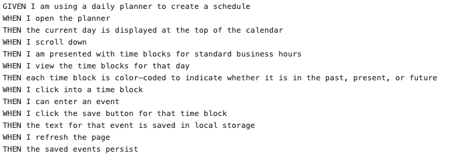
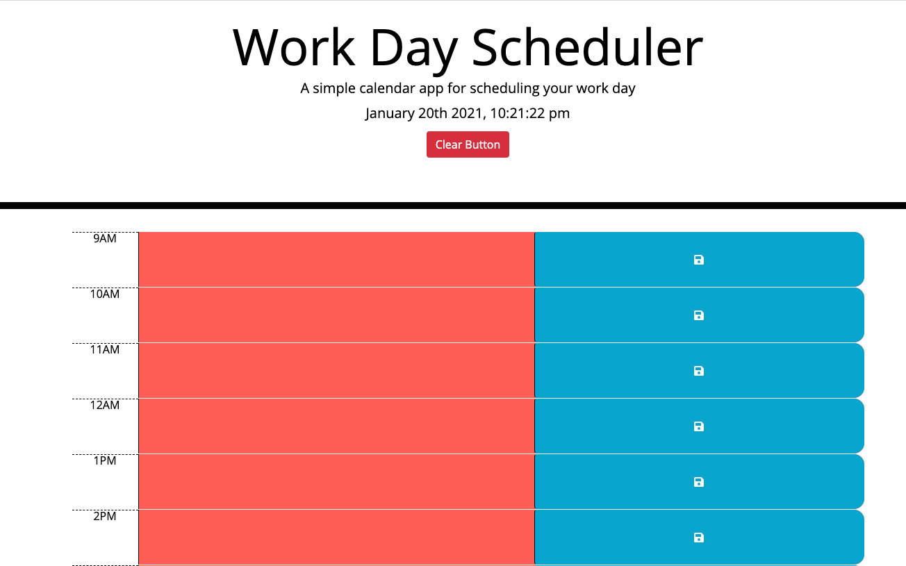

# work_day_scheduler

## Installation/Deployment

Open the html file in the browser. Another option is to go to this link: <https://github.com/skimmers/work_day_scheduler> and examine the html, css, and javascript files.

Please check to see if the assignment goals are met.

## Goal

The goal is to create a day scheduler. The day and time should be listed at the top of the scheduler and users will be able to input text and save. 

These are the requirements I had to meet: 

## My Work Day Scheduler

Please see an image of my application:

# Purpose

I believe the purpose of this assignment was to test my abilities in CSS, HTML, JavaScript, and utilizing libraries. It was a good exercise to see how all the languages connected and worked together to create a product. I also learned how to find code from a library! I also learned how to store information in the local storage.

